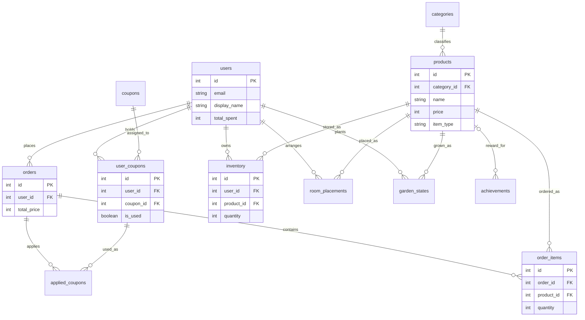

# Kotan プロジェクト ER図

このER図は、`テーブル定義書.md` に基づいて作成されています。
1対多（1:N）および多対多（N:M）の関係を視覚化しています。

## Mermaid ダイアグラム

## リレーションシップの定義

本システムにおけるテーブル間の関係性を「1対多（1:N）」と「多対多（N:M）」に分けて詳しく解説します。

### 1. 1対多 (1:N)
親テーブルの1レコードに対して、子テーブルの複数のレコードが紐づく形式です。

| 親テーブル (1) | 子テーブル (N) | 説明 |
| :--- | :--- | :--- |
| `users` | `orders` | 1人のユーザーは複数の注文を行うことができます。 |
| `categories` | `products` | 1つのカテゴリには複数の商品が属します。 |
| `orders` | `order_items` | 1つの注文には複数の商品明細が含まれます。 |
| `orders` | `applied_coupons` | 1つの注文に複数のクーポンを適用できます。 |
| `coupons` | `user_coupons` | 1つのクーポン種別は複数のユーザーに配布されます。 |
| `user_coupons` | `applied_coupons` | 1つの所持クーポンは特定の注文に適用されます。 |

### 2. 多対多 (N:M)
中間テーブル（Junction Table）を介して、両方のテーブルが互いに複数のレコードと紐づく形式です。

| テーブル A | テーブル B | 中間テーブル | 説明 |
| :--- | :--- | :--- | :--- |
| `users` | `products` | `inventory` | ユーザーは複数の商品を所持し、商品は複数のユーザーに所持されます。 |
| `users` | `products` | `room_placements` | ユーザーは複数の家具を配置し、家具は複数のユーザーの部屋に配置されます。 |
| `users` | `products` | `garden_states` | ユーザーは複数の種を植え、種は複数のユーザーの庭で成長します。 |
| `users` | `coupons` | `user_coupons` | ユーザーは複数のクーポンを持ち、クーポンは複数のユーザーに保持されます。 |
| `orders` | `products` | `order_items` | 1つの注文に複数の商品が入り、1つの商品は複数の注文に含まれます。 |
| `orders` | `user_coupons` | `applied_coupons` | 1つの注文に複数の所持クーポンが使われ、1つの所持クーポンは複数の注文に使われる（分割利用等想定）。 |
