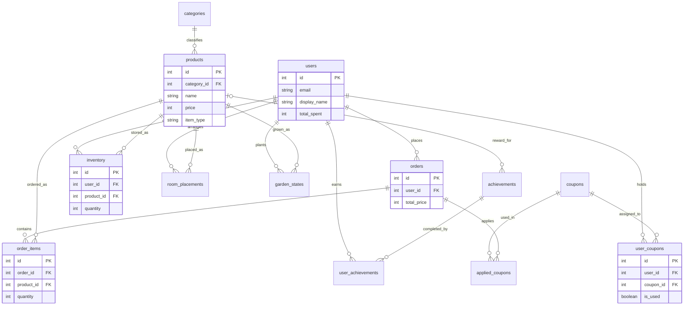

# Kotan プロジェクト ER図

このER図は、`テーブル定義書.md` に基づいて作成されています。
1対多（1:N）および多対多（N:M）の関係を視覚化しています。

## Mermaid ダイアグラム

## 関係性の要約

- **1対多 (1:N)**: `users` と `orders`、`categories` と `products` など。
- **多対多 (N:M)**: 中間テーブル（`inventory`, `order_items`, `user_coupons` 等）を介して実現されています。
    - ユーザー ↔ 商品 (所持品、配置、庭の状態)
    - ユーザー ↔ クーポン (所持クーポン)
    - 注文 ↔ 商品 (注文明細)
    - 注文 ↔ クーポン (適用クーポン)
